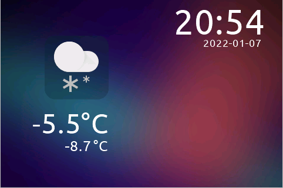
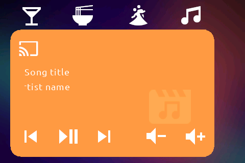
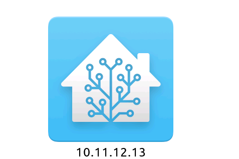
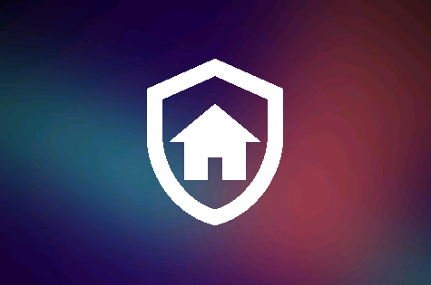
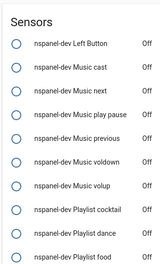

# NSPanel-MF
Current version: 2022-01-19. _Changelog further down_

Custom HMI controlled by ESPHome for the Sonoff NSPanel. Includes home screen with weather data and clock, media player card, control of 8 lights per card with 4 available cards (can be enabled/disabled from ESPHome/HA), bootup screen and disable screen for alarm. Audible notifications can be sent from Home Assistant that remain visible on the screen for a set period of time. The screen dims down and turns off similarly to a iPhone (dim down + screensaver) and is woken up by tapping the display. More to come.

Navigation is done by swipe gestures.

All content on the screen can be controlled from ESPHome and is very easily integrated to Home Assistant.

[Youtube video](https://www.youtube.com/watch?v=2e5-53lGF94)

[Youtube video of notification function](https://youtu.be/fmObpwFJT7o)

## Credits
I created this based on information shared in the following forum threads:
[Home assistant thread](https://community.home-assistant.io/t/sonoff-nspanel-smart-scene-wall-switch-by-itead-coming-soon-on-kickstarter/332962/), 
[ESPHome thread](https://github.com/esphome/feature-requests/issues/1469)

Significant parts of the ESPHome config and ideas in the HMI are from [Masto](https://github.com/masto/NSPanel-Demo-Files/).

The HMI theme is based on the [Lovelace iOS dark mode theme](https://github.com/basnijholt/lovelace-ios-dark-mode-theme)

Weather icons are from [simple weather card](https://github.com/kalkih/simple-weather-card)

Light icons on the Lights-page are from [Hass BHA Icons](https://github.com/hulkhaugen/hass-bha-icons)

Other icons are from [Material Design Icons](https://materialdesignicons.com/)

The font is the Ubuntu font.

Touch swipe navigation inspired by [blakadder](https://community.home-assistant.io/t/sonoff-nspanel-smart-scene-wall-switch-by-itead-coming-soon-on-kickstarter/332962/120)

The ESPHome config yaml is based on [Masto's example config](https://github.com/masto/NSPanel-Demo-Files)

## HMI Screenshots

_Not all exposed entities are visible on the screenshot._ 
_The items look slightly poorly centered. This is to cope with the issue that the physical screen is larger than the visible area._

## Usage
The weather entities, media entities, lights etc. are selected in the ESPHome config. You can navigate between screens by using a swipe gesture on the screen (left or right). The code is prepared for swipe up and down as well. The media player is on the left side, and the lights on the right side.
The config that is not done in ESPHome is done in Home Assistant.

In the example config a big part of the config is done in the ESPHome YAML file. If you prefer to set-and-forget it, you can replace the media entities, weather entities, light entities etc. with HA templates or input_text fields. That way you can re-configure everything directly from Home Assistant.

Any information and/or code found here is used on your own risk.

## Installation
1. Install and configure ESPHome.
2. Prepare the NSPanel for flashing (see instructions in the forum pages linked above).
3. Download the ESPHome sketch and adjust to your needs. Flash it to the NSPanel. Pay special attention to the _tft_url_ parameter and ensure it is accessible by the NSPanel.
4. Download the HMI file and save it to the _tft_url_ location.
5. Add the unit to Home Assistant through the ESPHome integration.
6. Run the _esphome.nspanel_upload_tft_ service from Home Assistant. This will download the HMI to the NSPanel. Please note that this will block the ESPHome connection during the update. Follow the progress on the HMI screen. When the HMI is installed, reboot the unit.
7. Configure the unit in Home Assistant to add actions to the buttons etc. it exposes.
8. Enjoy!

## Changelog (latest revision 2022-01-19)
- Swipe support! Navigation between pages is now done by swiping the screen left or right. Code prepared for up and down as well. Based on blakadder's method. A page "Swipe", id 12, is available to adjust the threshold values and to make the code easily transferable to your custom design. The actual threshold values are stored as global variables in the Program.s-tab in the Nextion Editor.
- The screen will automatically naviagte back to the Home screen if left untouched for a set period of time. Can be disabled from HA, but that also disables dimdown and screensaver.
- Dimdown and screen saver. The screen will dim down after a set period of time if left untouched (30 s). After 30 more seconds (1 min in total), the "screensaver" will go on. This makes the screen all black and turns off the backlight. The function was inspired by masto's setup, but slightly modified to make GUI development easier and to better work with multiple pages.
- Multiple Lights pages that can be enabled and disabled from ESPHome - even dynamically during runtime if needed.
- QR page added to display QR codes. The page works, but the service is broken. Need to figure out a way to pass the actual data to it. What already works is to manually go to the QR page and to manually set the QR data. The corresponding QR image is then generated.
- Fixed so that the weather symbol for sunny after sunset is clear-night
- Added Home.text1 and Home.text2 with a small font to the lower right corner of the Home page. I use them to display the fuel/charging state and ranges of our cars.

## Breaking changes (latest revision 2022-01-19)
Component numbering changed as the old navigation hotspots have been removed. Affects Music and Light page.

## TODO
Somewhat in a priority order:
- Add equipment page for vacuum robot, lawn mower robot, AC.
- Add electrical power monitoring page
- Fix QR page (my idea is to use it to share Wifi-access without passwords)
- Add support for RGBW lights (change color etc).
